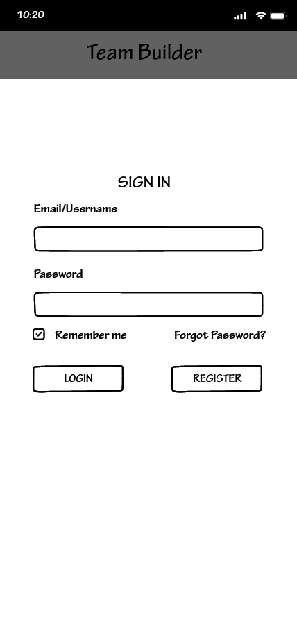
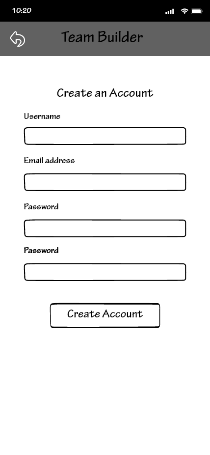

# Phase II: Refining interaction and designing wireframes

**Members: Nicholas Shaddox, Zane Gabor, and Fabian Garcia**

# Methods

We used Wireframing, Cognitive Walkthroughs, and Informal Feedback during this phase of research to better understand our user base.

## Wireframing

We used wireframing as a fast way to produce the interactive design of our application (strictly the portion of the mobile application). Wireframing allowed us to design and redesign with a relatively low cost with respect to time and money. Wireframing is the designed layout of a user interface that showcases the function and spacial position of each element on a page.

**Complete list of [wireframes](https://github.com/UsabilityEngineering/team-builder/tree/main/wireframes)**
| Login | Registration | Homepage (New User) |
| --- | --- | --- |
|  |  |  | 

## Cognitive Walkthrough
We used peer-reviewed cognitive walkthroughs during this phase. A cognitive walkthrough is an idea of performing a task from the perspective of the user. This user is one of our personas and the task is taken from one of the scenarios from that persona. We received two cognitive walkthroughs but one of them was especially helpful and very detailed. It was very well written (as a walkthrough) and help us discover many issues without wireframes and the overall design of the application.

This walkthrough was done with our [persona](https://github.com/UsabilityEngineering/team-builder/tree/main/personas) of **Chelsea Bell**.

Education: B.A. in Liberal Arts 

Chelsea recently bought a house and enjoys having company over. She has a cat and a dog and loves to go out on the weekends. When the weather allows, She enjoys going sailing with her friends and family. She uses a lot of group activities to promote sharing and team building. She would like a new way to group students.

Goals:
* Group compatible students together
* Make sure all students are in a group

> Chelsea doesn’t have an account and clicks register to sign up for the app. She knows she is making progress and did the right thing as the page loads the registration page.
>
> Chelsea fills out her information and hits register. She knows she is making progress as she reaches the homepage. She knows she is doing the right thing as she got access to the home page.
>
> Chelsea doesn’t know exactly what to do to accomplish her goal at the moment as there are no explanations but symbols for buttons on the screen. The plus symbol is fine, but what is the symbol for? Adding or creating what?
>
> Chelsea clicks the Plus Icon thinking it will add a team. She knows she is making progress as she sees the create a team page and thinks is making progress toward her goal.
>
> Chelsea fills out the information with the team name plus the number of students in her class as the team size. She knows she is making progress as she gets to the page that has her newly created team and thinks she is making progress toward her goal.
>
> Chelsea realizes that it is for an individual team and knows she wants a group of teams for her class.
>
> Chelsea Hits the back arrow. She knows she is making progress toward her goal as she goes back to the homepage. She thinks she is making progress toward her goal.
>
> Chelsea clicks on the second plus icon to see if it will help her and carefully looks at the screen this time. She knows she is making progress as she can see that she is making a group of teams. She is making progress toward her goal as she is on the create a group page.
>
> Chelsea enters the number of teams she needs based on her class size with the group name and creates the group. Chelsea knows she is making progress as she gets to a
page with her newly created group. She is making progress toward her goal.
>
> Chelsea sends her class the member invite key. She has no idea if she is making progress at this point. Has no idea what the member invite key does.
>
> Chelsea clicks on the hamburger icon in the group. She has no idea if she is making progress or not. The buttons beside delete the group are not clear or not clear what they do.
>
> Chelsea has no idea how to create teams in her group for her class. Buttons are not very clear. Chelsea knows for sure she is making no progress at the moment.
>
> Chelsea decides to make individual teams for her class, She clicks the plus icon for individual teams. She knows she is making progress as she sees the team creation
page. She has no idea if she is doing the correct actions to progress toward her goals or not now.
>
> Chelsea enters the team name and the number of students she wants in the group and hits creates the team. She knows she is making progress as she is now on the page of the newly created team. She has no idea if she is doing the correct actions to progress toward her goals or not now.
>
> Chelsea has no idea again what to do at this point and decides to click the hamburger button. She has no idea if she is making progress or not as it isn’t clear how to add students to any team she makes. She has no idea if she is doing the correct actions to progress toward her goals or not now.
>
> Chelsea cannot figure out how to progress in the teambuilder app and can’t complete her goals and scenario.

## Findings
Going from the sketches to the wireframes was a drastic change, not just from the visual aesthetic (although similar), but also from the workflow. It was much easier to collaborate with the team using Adobe XD than it was to coordinate any sketches. It was made easier because we could see any changes that were made in real-time. 

**Wireframes**
* Having a complete set of wireframes is more valuable than a partial set of sketches
* Some text spaces were increased in size to make room for longer fields
* We were able to visualize the main page (homepage) more clearly and functionally since you will see this page more than 90% of the time
* We realized that we were missing the settings button for teams/groups and the app settings button
* Some aspects are difficult to program
* We need to add user feedback for items such as deleting a group

**Cognitive Walkthrough**
* Registration and login were clear
* Our "create team/group" button was not clear
  * Both walkthroughs had this problem and guessed the wrong button to create a group
* It was difficult to know what button goes to what page based on the wireframes
* Home page what not designed to direct new users on what to do once they register
* None was able to complete their tasks in the walkthrough
* The walkthroughs made us realize that some of our scenarios could be updated
  * We should also consider coming up with some new personas and scenarios
 

## Conclusion
* Having higher fidelity in wireframes helped us discover some of the shortcomings that our sketches could not provide insight on.
* We addressed the text size and spacing along with button placement. The app bar was also adjusted for longer text.
* We also addressed the size and shape of buttons which were mimicked from other chat programs but don't work well for our overall design
* Based on the cognitive walkthroughs, we have fixed the buttons that create a group and team by combining them into a single button
  * You now only have the option to create a group and within building that group, you are directed to build a team(s) within that group
  * We have also added parameters within the group creation page so that our scenarios can be completed.
 

## Caveats
* limited to 2 cognitive walkthroughs
* Wireframes were incomplete at the time of the walkthrough
* Personal bias even while using persona/scenario
* Wireframes are not responsive and testers have to guess what page they think will be next

