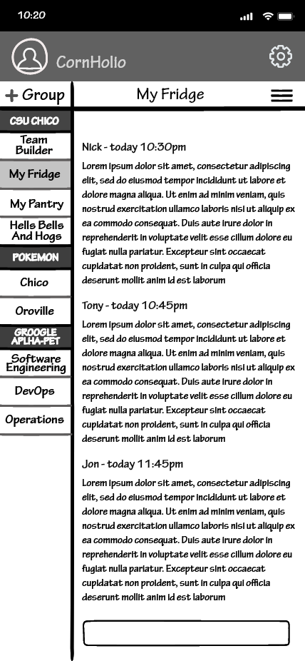

# Team Builder Wireframes
<table>
<tbody>
<tr>
<td></td>
<td>1. The first thing you will see when logging into the app is the Login page. Here we have a place for a Username and Password with The ability to Log in or Register a new account if one is not already created.</td>
</tr>
<tr>
<td></td>
<td>2. When selecting to Register, the user is prompted to input a username, email address, and password and is then prompted to create their account.</td>
</tr>
<tr>
<td></td>
<td>3. Upon account creation, the user is prompted to create or join their first group</td>
</tr>
<tr>
<td></td>
<td>4. Tapping the + Group button will display two buttons for either creating or joining a group.</td>
</tr>
<tr>
<td></td>
<td>5. Selecting Create Group will take the user here where they can give the group a title and a description.</td>
</tr>
<tr>
<td></td>
<td>6. Upon selecting Join Group the user will be prompted to enter a group key, which is generated on group creation.</td>
</tr>
<tr>
<td></td>
<td>7. Once a group is joined, the user is given the option to join whatever teams happen to be available under that group.</td>
</tr>
<tr>
<td></td>
<td>8. This is the central hub for pretty much all functionality of the app. If the user already has an account, this is what will be seen upon login.</td>
</tr>
<tr>
<td></td>
<td>9. Tapping on the header will take you to a view of a list of teams encompassed by that group where each team can be interacted with to take you to their respective team page. By tapping on the + icon, the user can add another team to the currently selected group.</td>
</tr>
<tr>
<td></td>
<td>10. When adding a team to a group, the user is given the ability to name the team as well as give it a description. There is also a check box to limit team size, as well as a section to add various user-made parameters.</td>
</tr>
<tr>
<td></td>
<td>11. The create parameter page allows the user to add roles to the teams as well as give each role an individual title. There is also a check box that allows the user to limit how many of a particular role the user wants on a team.</td>
</tr>
<tr>
<td></td>
<td>12. Created parameters will appear under the add parameter text next to a check box where they can be activated. Each custom parameter will be saved to the account that created it for future use in team building.</td>
</tr>
<tr>
<td></td>
<td>13. Once a team is created a small tab will drop down from the top of the screen to confirm that the task was completed.</td>
</tr>
<tr>
<td></td>
<td>14.  The hamburger in the corner (the three bars) provides a drop-down menu of which the user can choose to edit or delete a team.</td>
</tr>
<tr>
<td></td>
<td>15. After selecting to edit a team, the user is presented with the ability to change the team's name and description, as well as add and remove people from the team (a function limited to admin).</td>
</tr>
<tr>
<td></td>
<td>16. Once the team has been edited a small tab will drop down from the top of the screen to confirm that the task was completed.</td>
</tr>
<tr>
<td></td>
<td>17. The hamburger in the corner provides a drop-down menu of which the user can choose to edit or delete a team.</td>
</tr>
<tr>
<td></td>
<td>18. Upon selecting delete the user is prompted with a secondary confirmation to ensure team deletion was intentional.</td>
</tr>
<tr>
<td></td>
<td>19. Once the team has been deleted a small tab will drop down from the top of the screen to confirm that the task was completed.</td>
</tr>
<tr>
<td></td>
<td>20. Tapping the gear in the top right corner of the screen will display a drop-down menu that allows the user to access general settings, the user profile, and the sign-out function.</td>
</tr>
<tr>
<td></td>
<td>21. Tapping settings will take the user to the settings page where the font size can be changed and dark mode can be enabled.</td>
</tr>
<tr> 
<td></td>
<td>22. Tapping the gear in the top right corner of the screen will display a drop-down menu that allows the user to access general settings, the user profile, and the sign-out function.</td>
</tr>
<tr>
<td></td>
<td>23. Tapping the profile will take the user to their information page. Here is the email associated with the account, as well as all groups and teams the user may be a part of.</td>
</tr>
<tr>
<td></td>
<td>24. Tapping the gear in the top right corner of the screen will display a drop-down menu that allows the user to access general settings, the user profile, and the sign-out function.</td>
</tr>
<tr>
<td></td>
<td>25. Selecting sign-out will prompt the user to confirm that signing out was intentional before taking the user back to the sign-in page.</td>
</tr>
</tbody>
</table>
