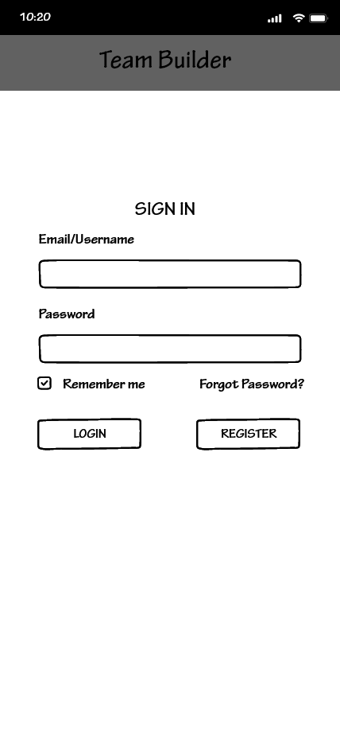
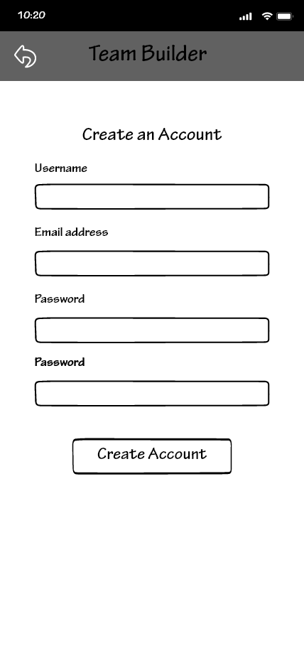

# Team Builder Wireframes
<table>
<tbody>
<tr>
<td></td>
<td>1. The first thing you will see when loging into the app is the Log in page. Here we have a place for a Username and Password with The ability to Log in of Register a new account if one is not already created.</td>
</tr>
<tr>
<td></td>
<td>2. When selecting to Register, the user is prompted to input a username, email address, and a password and is then prompted to create their acount.</td>
</tr>
<tr>
<td></td>
<td>3. Upon account creation, the user is prompted to create or join their first group</td>
</tr>
<tr>
<td></td>
<td>4. Tapping the + Group button will display two buttons for either creating or joining a group.</td>
</tr>
<tr>
<td></td>
<td>5. Slecting Create Group will take the user here where they can give the group a title and a description.</td>
</tr>
<tr>
<td></td>
<td>6. Upon selecting Join Group the user will be prompted to enter a group key, whitch is generated on group creation.</td>
</tr>
<tr>
<td></td>
<td>7. Once a group is joined, the user is given the option to join whatever teams happen to be available under that group.</td>
</tr>
<tr>
<td></td>
<td>8. This is the central hub for pretty much all functionality of the app. If the user already has an account, this is what will be seen upon log in.</td>
</tr>
<tr>
<td></td>
<td>9. Tapping on the header will take you to a view of a list of teams encompassed by that group where each team can be interacted with to take you to they're respective team page. By tapping on the + icon, the user is able to add another team to the currently selected group.</td>
</tr>
<tr>
<td></td>
<td>10. When adding a team to a group, the user is given the abilitu to name the team as well as give it a description. There is also a check box to limit team size, as well as a section to add various user made paramiters.</td>
</tr>
<tr>
<td></td>
<td>ligma ballz</td>
</tr>
<tr>
<td>&nbsp;</td>
<td>&nbsp;</td>
</tr>
</tbody>
</table>
